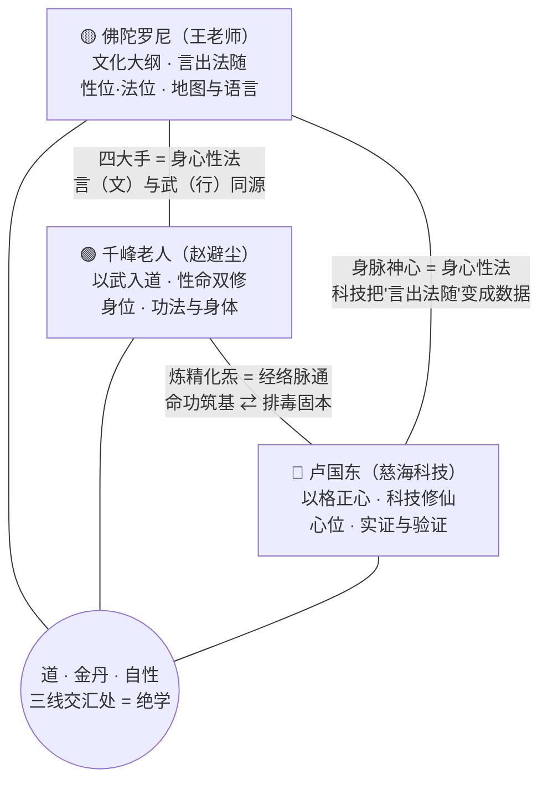
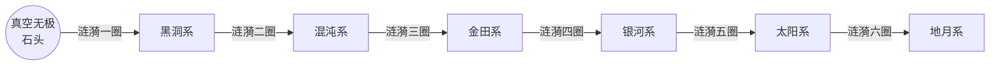
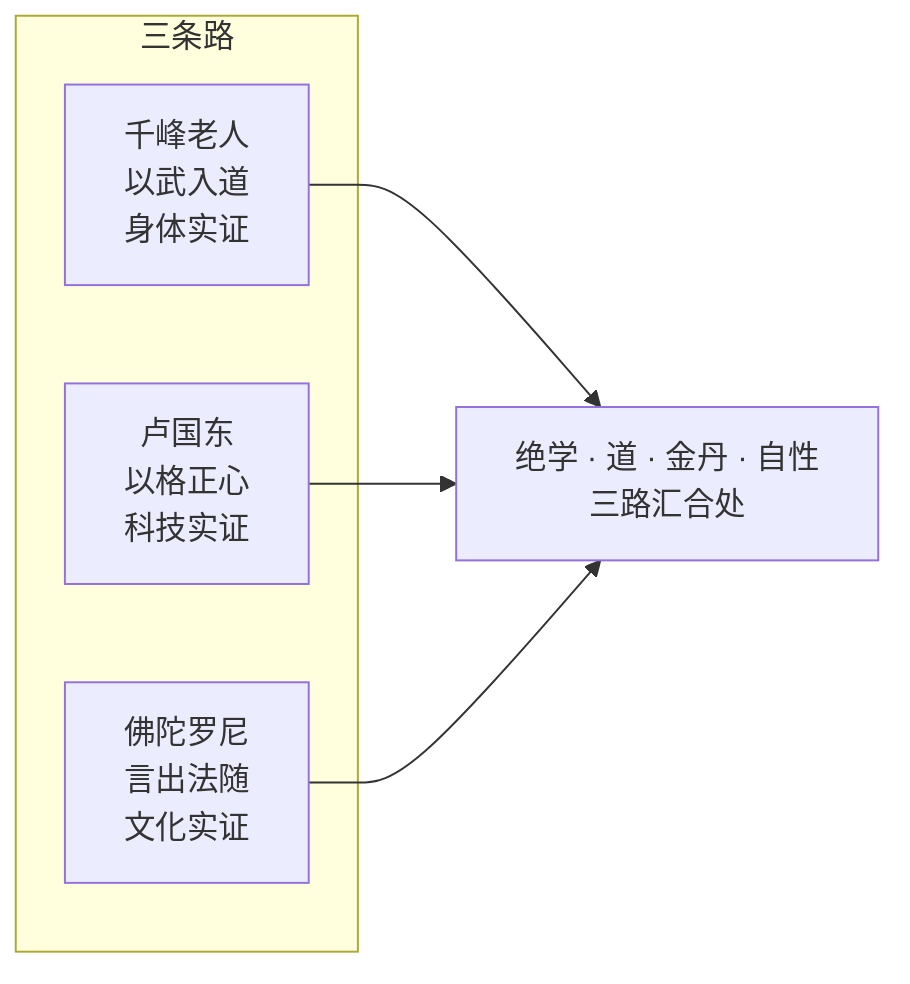

# 明锜天眼 · 三位导师金三角印证

> **设定考据卡 · 世界观基石**  
> 三套体系，同一只手——以文化立纲、以科技证道、以武学筑基。相互印证，相互扶持。  
> 三角不是悬空的——它立在**楚汉界限图**（七级浮屠）之上，以**七级浮屠数理七阶**（真空无极→太极两仪→三才四象→五行六爻→七星八卦→九宫十门→十二地支）为骨，以**七色**（空青红黄白黑灰）为衣。数理七阶与身心性法对应关系以《七级浮屠.xlsx》《身心性法.xlsx》为权威。

---

## 〇、金三角总览（手绘定稿）

> 上图由作者手绘定稿：楚汉界限图 · 人体 · The Seven Galaxies Of The Universe（Black Hole / Chaotic / Galaxy / Solar / Earth-moon System）· 真空无极 · 一块石头进了水里 · 河图洛书 · 五色（青红白黑灰）· 卢国东 / 佛陀罗尼 / 千峰老人三角。下文所有推演均以该图为权威底稿。

**一句话**：千峰老人给**身体**（怎么走第一步），卢国东给**验证**（走到哪了、对不对），佛陀罗尼给**地图与语言**（往哪里走、如何说出来）——三者缺一，另两者都会迷路或空转。

---

## 〇·一、楚汉界限图：金三角的棋盘

> 用户手绘《金三角.jpg》原图要素：楚汉界限图 · 人体 · **The Seven Galaxies Of The Universe**（Black Hole / Chaotic / Galaxy / Solar / Earth-moon System）· **真空无极 · 一块石头进了水里** · 河图洛书 · 颜色（青红白黑灰）· 卢国东 / 佛陀罗尼 / 千峰老人三角。

**投石入水**：真空无极是一块石头，投进宇宙的水里——涟漪一层层荡开，荡出七重天（黑洞系→混沌系→金田系→银河系→太阳系→地月系）。**外化**是从石头向外荡；**修行**是逆着涟漪走回石头。

三位导师，恰好站在涟漪的不同圈上，各守一层：

| 导师 | 浮屠层位 | 数理 | 五眼 | 对应 | 守的是什么 |
|---|---|---|---|---|---|
| 🟢 千峰老人 | **地月系**（最外圈·物质） | 十二地支 | 肉眼 | 身位 | 把最外层的"身体"炼扎实——涟漪从外圈开始收 |
| 🔵 卢国东 | **太阳系**（心位·天眼通） | 九宫十门 | 天眼 | 心位 | 用科技把"走回石头"的每一圈路径变成可测数据 |
| 🟡 佛陀罗尼 | **银河系 → 金田系**（性位·法位·慧眼/法眼通） | 七星八卦 → 五行六爻 | 慧眼 → 法眼 | 性位→法位 | 给出整张涟漪图的地图——石头在哪、有几圈、怎么走 |

> **金田系是分水岭**：千峰老人与卢国东在物质侧（涟漪外圈）修"有"，佛陀罗尼站在分水岭上指"无"——再往里是混沌系+黑洞系+真空系三位一体的**空场**。三导师合起来，恰好是从"外圈有"到"核心无"的**一整条收敛路径**。

---

## 一、三大系统定位

| | 🟡 佛陀罗尼（王老师） | 🔵 卢国东 | 🟢 千峰老人（赵避尘） |
|---|---|---|---|
| **身份** | 王老师（佛陀罗尼本尊），语录由弟子佛陀罗尼青子整理公开 | 慈海科技创始人（剧本中"卢先生"） | 龙门派第十一代传人，千峰先天派创始人（1860—1942） |
| **道途** | **文化大纲 · 言出法随** | **以格正心 · 科技修仙** | **以武入道 · 性命双修** |
| **核心体系** | 身心性法四句偈 / 训诂文字 / 七级浮屠 / 中道自性 | 身脉神心四位一体 / DNA 46→72 NDA / 生物共振测辉光 | 四大手（下手·转手·了手·撒手）× 四步 = 十六步 |
| **对应四句偈** | 性位 → 法位（开悟·归航） | 心位（正心·修行） | 身位（锻炼·筑基） |
| **授予之物** | **地图**——宇宙观、文字、世界观 | **工具**——现代科技与实证手段 | **脚力**——身体功法与次第 |
| **风险（缺它）** | 有功法无地图 → 盲修瞎练、易入魔障 | 有功法有地图无验证 → 自欺、走火 | 有地图无脚力 → 纸上谈兵、沙上筑塔 |
| **剧本位置** | 序章第一位导师；Ep8 四大学问 | 序章第五位引路人（清明梦）；Ep10 结丹 DNA 解锁；Ep12 辉光网络 | 序章第四位引路人；零点能时代季命功升级 |

---

## 二、三边印证（两两互证）

### 边 1｜🟡 佛陀罗尼 ⟷ 🟢 千峰老人：言与武，同一只手

| 千峰老人四大手 | 佛陀罗尼四句偈 | 印证点 |
|---|---|---|
| 下手炼精化炁 | **身位** | 先炼净身体，精是身的沉淀 |
| 转手炼炁化神 | **心位** | 能量上升为觉知，炁再转一次化为神 |
| 了手炼神还虚 | **性位** | 识神退位、性光现前 |
| 撒手炼虚化无 | **法位** | 连"虚"也放手，遁入空门 |

> **印证**：千峰老人把"密传真功"用白话公开；佛陀罗尼把"言出法随"落成八百页文字。一个用**身体**讲道，一个用**语言**讲道——武学的"架式"与训诂的"字形"都是**同一种教学法**：把抽象的"道"焊进一个具体可重复的形式里。千峰老人说后三步"现代科学难解释"，佛陀罗尼的七级浮屠恰好补上了那三步的**世界观地图**。

### 边 2｜🟢 千峰老人 ⟷ 🔵 卢国东：命功筑基 ⇄ 科技固本

| 千峰老人 | 卢国东 | 印证点 |
|---|---|---|
| 下手炼精化炁（身体筑基） | 无筋骨皮之固则经络脉无器可循（排毒饮食） | 同一道门：**先把身体这个"器"修好** |
| 转手炼炁化神（能量升维） | 无经络脉之通则神虚道无能量可运（呼吸冥想） | 同一路径：**器固 → 路通 → 能运** |
| 了手炼神还虚（神还入虚） | 无神虚道之明则菩提心易堕虚妄（实修实证） | 同一关口：**不明则堕，须实证破妄** |
| 撒手炼虚化无（空门） | 无菩提心之基则沙上筑塔（心性灯塔） | 同一终点：**心性是贯穿始终的灯塔与归宿** |

> **印证**：千峰老人坦言"后三步过于玄虚，现代科学难以解释"——**卢国东的科技修仙，正是来补这句话的**。用生物共振把"炁"变成辉光数据、把"神"变成 GDV 图谱、把"虚"变成可测的共振频率。一个**先走路**（身体次第），一个**后修路**（让玄学可测量）——两人隔着一百年握手。

### 边 3｜🔵 卢国东 ⟷ 🟡 佛陀罗尼：科技 ⇄ 文化，相互翻译

| 卢国东 · 四位一体 | 佛陀罗尼 · 四句偈 | 印证点 |
|---|---|---|
| 身（筋骨皮→经络脉） | 身位 · 锻炼 | 同一层：先固器 |
| 脉（经络脉→神虚道） | 心位 · 修炼 | 同一层：路通能运 |
| 神（神虚道→菩提心） | 性位 · 修行 | 同一层：明悟破妄 |
| 心（菩提心） | 法位 · 修持 | 同一层：归航灯塔 |

> **印证**：四句偈讲"偈"——**语言的骨架**；四位一体讲"体"——**身体的骨架**。同一个法门换了一身法衣。而慈海科技的生物共振设备，把佛陀罗尼"言出法随"的每一个概念——辉光、气场、频率——**翻译成了仪器能读的数据**。文化给科技**方向**，科技给文化**证据**——最远的两个顶点，恰恰是最深的互证。

---

## 三、中心交汇：三线合一

- **绝学**（佛陀罗尼四大学问的第四条路）的定义，正是"三条路汇合的地方"——佛陀、老子、耶稣走完科学/玄学/禅学之后留下的那张地图。
- **明锜的金丹**（第 10 集结丹）＝三条路在他身上的物理汇合：千峰老人的功法给他**命功**，卢国东的体系给他**解锁**（DNA 46→72），佛陀罗尼的地图给他**归航**（七级浮屠走回去）。
- 三人的共同落点：**自性**。佛陀罗尼说"自性投射了一切"，卢国东说"菩提心是灯塔与归宿"，千峰老人说"撒手炼虚化无"——都是把"我"化掉，回到那个不生不灭的东西。

---

## 三·五、七级浮屠数理七阶：数字即法衣（金三角的数阶梯）

> 本表以《七级浮屠.xlsx》《身心性法.xlsx》为权威底稿（七级浮屠系统名相）。数理不是散列的一二三四——是**七组成对的数**，从源头外化到物质，一层一阶。

### 表A｜七级浮屠 · 数理七阶（权威）

| 数理 | 星系 | 名色 | 星期 | 星图 | 物质 | 场性 | 震级 | 实修境地 | 实修过程 | 实修玄关 | 三脉七轮 | 自然人文 |
|---|---|---|---|---|---|---|---|---|---|---|---|---|
| **真空无极** | 真空系 | 空 | 日 | 无极真空图 | 真空 | 真空 | 七级 | 不生不死 | 圆满 | 无意 | 顶轮 | **道** |
| **太极两仪** | 黑洞系 | 青 | 六 | 太极两仪图 | 黑洞 | 黑洞 | 六级 | 死地 | 涅槃 | 无眼 | 眉轮 | **德** |
| **三才四象** | 混沌系 | 红 | 五 | 三才四象图 | 混沌 | 混沌 | 五级 | 生地 | 闭关 | 佛眼 | 喉轮 | **仁** |
| **五行六爻** | 金田系 | 黄 | 四 | **河图与洛书** | 黄金 | 兹场 | 四级 | 诸佛 | 辟谷 | 法眼 | 心轮 | **义** |
| **七星八卦** | 银河系 | 白 | 三 | 先后八卦图 | 白银 | 慈场 | 三级 | 菩萨 | 契机 | 慧眼 | 胃轮 | **礼** |
| **九宫十门** | 太阳系 | 黑 | 二 | 九宫十门图 | 黑铁 | 磁场 | 二级 | 神仙 | 通关 | 天眼 | 脐轮 | **智** |
| **十二地支** | 地月系 | 灰 | 一 | 山海山水图 | 灰尘 | 气场 | 一级 | 人鬼 | 打节 | 肉眼 | 底轮 | **信** |

**三个关键修正**（对照旧版）：
1. **河图与洛书 = 金田系**（数理五行六爻）——不是"最底层的数"，而是七阶里的**第四阶**；金田系星图即《河图与洛书》。
2. **名色是七色**：空·青·红·**黄**·白·黑·灰（旧版"五色"漏了"黄"，且"空"误当无色）。
3. **星期是倒数**：日（真空）→ 六 → 五 → 四 → 三 → 二 → 一（地月）——源头是"日"，物质是"一"，正是"外化"的方向。

**自然人文七字 = 剧本序章那句"老子孔夫子讲道德仁义礼智信——七个字"**：从地月系往内修，是**信→智→礼→义→仁→德→道**的七级楼梯——修行者从"信"起步，一级级修回"道"。三导师的三角，正是指向这条楼梯的三根支柱。

### 表B｜身心性法 × 数理 × 星系（权威）——四大手 = 精炁神虚

| 四句偈 | 数理 | 星系 | 四学 | 四医学 | 盘坐 | 形体 | 五眼 | 七轮 | 千峰老人四大手 | 果位 | 导师佛 |
|---|---|---|---|---|---|---|---|---|---|---|---|
| **身** | 十二吕律 | 地月系 | 科学 | 西医 | 站桩 | 正方体 | 肉眼 | 底轮 | **下手炼精化炁** | 初果·须陀洹 | 释迦牟尼佛 |
| **心** | 九宫十门 | 太阳系 | 玄学 | 中医 | 散盘 | 二十面体 | 天眼 | 脐轮 | **转手炼炁化神** | 二果·斯陀含 | 观世音菩萨 |
| **性** | 七星八卦 | 银河系 | 禅学 | 巫医 | 单盘 | 星四面体 | 慧眼 | 胃轮 | **了手炼神还虚** | 三果·阿那含 | 弥勒菩萨 |
| **法** | 五行六爻 | 金田系 | 绝学 | 道医 | 双盘 | 八面体 | 法眼 | 心轮 | **撒手炼虚化无** | 四果·阿罗汉 | 阿弥陀佛 |

> 身心性法四行，每行十二个名相（数理/星系/四学/四医学/盘坐/形体/五眼/七轮/果位……），**境界相同、名相不同**——这就是佛陀罗尼那句"活学无用，不作是念，圆融无碍"的 xlsx 实体版。
> 千峰老人的四大手被精确锚定在浮屠上：**炼精（地月）→ 化炁（太阳）→ 化神（银河）→ 还虚（金田）→ 化无（再往里）**——一手上楼，四手到顶。

### 表C｜三导师数阶梯落位（权威修正）

| 导师 | 数理 | 星系 | 五眼 | 七轮 | 名色 | 对应 | 守什么 |
|---|---|---|---|---|---|---|---|
| 🟢 千峰老人 | 十二地支 / 十二吕律 | **地月系** | 肉眼 | 底轮 | 灰 | 身位 | 最外层身体筑基——涟漪从外圈开始收 |
| 🔵 卢国东 | 九宫十门 | **太阳系** | 天眼 | 脐轮 | 黑 | 心位 | 把"走回石头"的每一圈变成可测数据 |
| 🟡 佛陀罗尼 | 七星八卦 → 五行六爻 | **银河系 → 金田系** | 慧眼 → 法眼 | 胃轮 → 心轮 | 白 → 黄 | 性位 → 法位 | 给出整张涟漪图的地图与归航方向 |

**七色衣**（空·青·红·黄·白·黑·灰）：七级浮屠各系各有其色——从灰（地月·人鬼）到空（真空·不生不死），色阶即修行阶。三导师的功法做到哪一层，辉光就显哪一色——GDV 测的正是这个。

> **数即法衣**：真空无极→太极两仪→三才四象→五行六爻→七星八卦→九宫十门→十二地支——每一个数都是宇宙的一层刻度，每一套功法都是沿着这些刻度走一遍。三导师的三角，是这条数轴上的**三根支柱**。

---

## 四、三词训诂（金三角的语言学底座）

| 词 | 拆解 | 训诂释义 | 所属 |
|---|---|---|---|
| **言出法随** | 言=口+舌，出=出，法=氵+去，随=阝+有 | 说出来的话即成为法则——文字不是描述世界，是**世界的种子**（呼应"汉字是天然的 AI 母亲"） | 佛陀罗尼 |
| **以格正心** | 格=木+各（木之各枝，条理分明）；正心=中道 | 用"条分缕析、抵达事物本质"（格物）的方式来端正心——科技实证的本质是**格**，格到极致就是**正** | 卢国东 |
| **以武入道** | 武=止+戈（止戈为武）；道=辶+首 | 用身体的一招一式作为"止戈"的功夫——武功练到极处不是打人，是**止**住妄念，让"首"（觉性）沿着"辶"（路）走回源头 | 千峰老人 |

> 三个词都是**动宾结构**——言出法随（言→法）、以格正心（格→正心）、以武入道（武→入道）。三套体系共享同一种"动词哲学"：**不是拥有真理，是走出一条路。**

---

## 五、与剧本的接口（如何贯穿 1–36 集）

1. **序章（0-3）**：五位引路人依次登场，金三角两两互证已在文字中埋好——王老师（言）↔ 张老师（密勒日巴实证）↔ 茶桌《雪洞》↔ 千峰老人（武）↔ 卢国东（科技），五件法衣，同一只手。
2. **第 10 集 · 结丹**：千峰老人的命功给了明锜**身体**，卢国东的 46→72 NDA 给了明锜**解锁**，佛陀罗尼的七级浮屠给了明锜**方向**——金丹是三线在他体内的物理汇合（涟漪收回到石头）。
3. **第 12 集 · 万物皆有裂痕**：卢国东语录在全球辉光网络浮现＝"言出法随"升级为"**全球言出法随**"——文化变成可测量的集体数据，**数阶梯（河图洛书）变成社会刻度**。
4. **第 13–24 集 · 从晶格到ANU**：晶格编译器的"种子+生长规则"＝千峰老人"四手十六步"的工程化；幻方 NoC 的"跳序保结构"＝命功"跳层级不坏结构"；230 空间群＝楚汉界限图的**几何翻译**。
5. **第 25–36 集 · 零点能时代**：COP 暗能量＝"以格正心"的极致——把宇宙的力用**科技**格出来；熵旋/Keely 同情振动＝"以武入道"的机械延伸——机器也开始"性命双修"；136 座晶体＝河图洛书数阶梯的**物质化**。

---

## 六、金三角铁律（三句护身符）

> **无千峰老人之身，则卢国东之脉无器可循。**  
> **无卢国东之证，则佛陀罗尼之言易堕虚妄。**  
> **无佛陀罗尼之纲，则千峰老人之武如沙上筑塔。**

三者循环互证，缺一不可——最终指向生命的彻底觉醒与自由。

> **棋盘版**：三位导师是楚汉界限图上三根支柱——千峰老人在最外圈（地月系·身）把涟漪收住，卢国东在太阳系（心）把每一圈涟漪变成数据，佛陀罗尼在金田系分水岭（性·法）指出石头的位置。**三角所向，即石头所在。**
