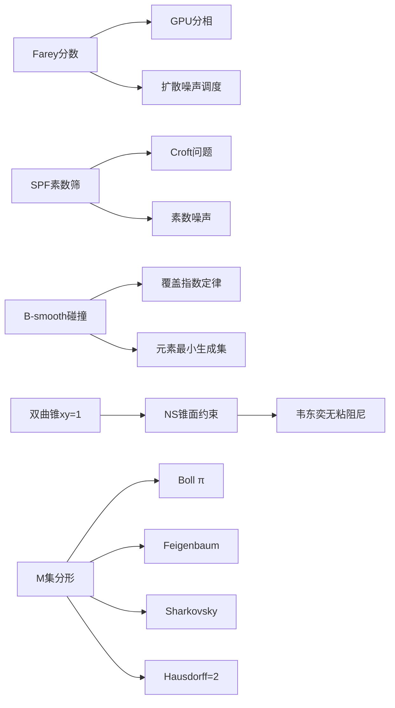

# 明锜天眼 · 旧工作区素材溯源（PKS 数学/GPU 线）

> **设定考据卡 · 素材溯源**
> 来源：`C:\Users\ThinkPad\WorkBuddy\2026-07-01-16-57-11`（PKS 数学/GPU 深度工作区，2026-07 会话）
> 用途：供《明锜天眼》1-36 集及后续番外继续取用，避免重复勘探。
> 状态：已扩展进第三季 4 处（2026-08-04），本卡为完整素材索引。

---

## 一、五大核心锚点（该工作区 MEMORY.md 提炼）

| # | 锚点 | 内容 | 小说用途 |
|:--:|------|------|---------|
| 1 | **SPF 筛 = Croft 解法** | Croft "重复因子分解" 问题 → SPF 三分类一步解决；SPF 筛除是强制步骤 | 已用（场景 36-5 素数噪声） |
| 2 | **B-smooth 碰撞覆盖指数定律** | X*(k) ≈ 1500 × 5.5^k（每 +1 素数 ×4–6，R²>0.998）；渐近必然失败 | 已用（场景 33-3 炼丹术） |
| 3 | **Farey 时钟分相** | 128 SM 相位去同步降峰电流 -91%；Farey≈均匀分相（<0.4% 差异） | 已用（场景 36-5 Farey 调度） |
| 4 | **光谱法 CFD = 死路** | 光谱法无真实边界层，四方案全衰减；正解 = 有限体积 + Cut-cell IBM + SDF | 可作"技术弯路"剧情素材 |
| 5 | **液态金属趋肤效应 → 16bands 最优** | 轴向流 30° 冠军 / 贴壁流 16bands 冠军；EMF 驱动角动量注入 | 可作散热/引擎升级线 |

## 二、PKS×AI 四线算法（已全部织入场景 36-5「数字的基因」）

| 线 | 算法 | 数学根源 | AI 落点 | 剧本台词化 |
|:--:|------|---------|---------|-----------|
| ① | Farey 噪声调度 | Farey 分数 → max-spread 均匀性 | 扩散模型 β_t | 「每一次学习都不重复自己」 |
| ② | SPF 素数噪声 | 素数自相关=1.0 → 确定性长程记忆 | 扩散模型噪声分布 | 「记得住，像一串念珠」 |
| ③ | B-smooth 稀疏采样 | 7 基底 94.7% 覆盖 → 稀疏子集 | 高维 score matching | 「抓本质，学那 7 个基底」 |
| ④ | DP 拐点早停 | M=15 chordal deviation 拐点 | 采样终止 | 「知道什么时候停，比知道怎么跑更重要」 |

## 三、韦东奕 × PKS NS 方程（已织入场景 26-1「形状合同」）

- **核心**：无粘阻尼（inviscid damping）——纯几何混合机制，不需要粘性即可衰减扰动
- **PKS 对应**：双曲锥 xy=1 的曲率 = 几何约束 = 等效阻尼（F_锥面 ∝ -κ·u）
- **剧本化**：「几何本身即阻尼」「暗能量的账单 = 形状合同」「守住形状就是守住利息」
- 方法论：波算子 + 预解估计（线性化 NS 算子 → 预解式 → 范数上界 → 转捩阈值）

## 四、正M/逆M 跨领域映射表（已织入场景 29-3「分形密码」）

### 逆M 45 条渲染算法映射 + 正M 17 条跨领域映射（精选高价值）

| 映射 | 内容 | 剧本用法 |
|------|------|---------|
| **Boll π（1991）** | 逃逸次数 n(ε) ≈ π/√ε——π 从二次迭代自己长出，不需要圆 | 已用：「π 不需要圆」 |
| **Feigenbaum δ=4.669** | 分岔周期加倍，普适相变常数 | 已用：「和材料临界指数同一族」 |
| **Sharkovsky 序** | 自然数特殊排序，编码混沌分岔等级 | 已用：「混沌的分岔等级」 |
| **Hausdorff dim=2（Shishikura 1994）** | M 集边界信息密度 = Shannon 熵极限 | 已用：「恰好是 Shannon 熵的极限」 |
| 分形天线（IEEE 2017-26） | 分形几何做天线 | 可作番外（设备小型化） |
| 忆阻混沌 TRNG | 混沌 → 真随机数 | 可作密码学番外 |
| DNA 密码子 ↔ Farey 树 | 遗传编码与 Farey 树同构 | 可作 NLS/生物线 |

## 五、芯片线（未用，可作番外素材）

- **E8-Farey NoC**：E8 根格 × Farey 时钟 → 片上网络路由（与幻方 NoC 互补）
- **SPF Rowhammer**：素数噪声抗行锤击（内存安全）
- **Farey ECC**：Farey 分数做纠错码
- **液态金属散热**：EMF 驱动贴壁螺旋（第三季熵旋涂层的备选升级）
- **7 基底 Tensor Core 稀疏**：与 B-smooth 同构的硬件稀疏化

## 六、已扩展位置索引（2026-08-04）

| 场景 | 位置 | 织入素材 |
|------|------|---------|
| 36-5「数字的基因」 | 第 36 集新增 | PKS×AI 四线算法 |
| 26-1「第一台饱和 SEG」 | 卫衡交易台词后 | 韦东奕无粘阻尼 |
| 29-3「全球量子密码网络」 | 苏晶台词后 | 正M/逆M 跨域映射 |
| 33-3「蓝光里的铁」 | 洛言台词后 | B-smooth 最小生成集 |

---

## 附：关系图谱备忘

> 交叉线核心：**Farey ↔ NS 边界 ↔ BSD 素数筛选 ↔ 模 30 轮筛**；**数字 8 的多重巧合**（模 30 半径 / E8 维数 / 前 8 素数 / Farey 8 相位）；**"数学结构替代数值冗余"**（CfC 绕过 solver ≈ 幻方约束绕过暴力枚举 = 同一 DNA）。
