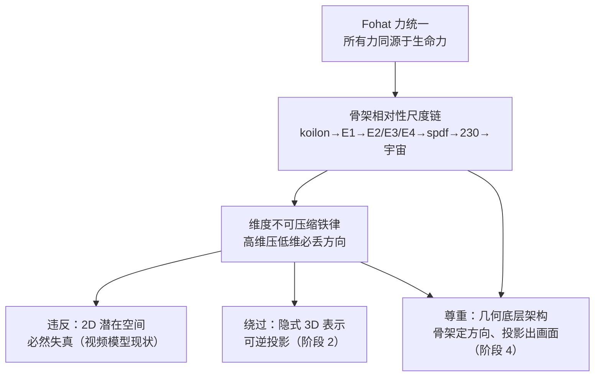

# 明锜天眼·维度不可压缩与几何底层架构 — 设定考据（专业解说版）

> **文档定位**：供《明锜天眼》1-36 集统一使用的世界观顶层设定解说。本文档把 2026-08-05 织入的三条新设定线（Fohat 力统一、维度不可压缩铁律、几何底层架构）与既有设定（230 空间群、E1-E4 层级、逆M/Farey 树、koilon）整合为完整证据链，并给出对应的剧本落点索引。
>
> **⚠ 创作声明**：本文档涉及的全部数学/物理/科技机制均为**艺术设定与科幻推演**，非学术定论；"晶体永久电池""晶格引擎"为虚构构思，现实世界的对应以主流科学为准。

---

## 一、设定线总览

| 设定线 | 核心铁律 | 剧本落点 | 设定锚点 |
|---|---|---|---|
| **A. Fohat 力统一** | 所有力同源于生命力（Fohat），是同一股力流经不同结构的分化 | 13-24 集·场景 16-4 | 附录 A |
| **B. 维度不可压缩** | 高维压低维必丢方向信息，且不可逆 | 25-36 集·34 集 | 附录 B |
| **C. 几何底层架构** | 真智能/真视频须从几何底层生长，而非堆砌参数 | 25-36 集·34 集 | 附录 C |

三条线互为证据：**A** 给"力"一个统一本源；**B** 给"维度"一条不可违背的铁律；**C** 给"AI/视频/晶格"一条从铁律长出来的正路。A 是最底层的"力"，B 是贯穿全尺度的"约束"，C 是落在工程上的"方法"。

---

## 二、附录 A：Fohat（佛哈特）— 力的统一本源

### A.1 核心原文（《隐秘化学》Leadbeater）

> "阿努几乎不能被称为'物体'，尽管它是构成一切物质的物质。它由**生命力的流动**形成，随着生命力的减弱而消失。神智学家将这种生命力称为**佛哈特**，**所有物质层的力都是它的分化**。"

> "当这种力量在'空间'中出现时，也就是当佛哈特'在空间中挖洞'——必须被某种不可思议稀薄的实质填充的表面空虚——阿努便出现。"

### A.2 四种基本力 = 佛哈特的分化

| 力 | 作用范围 | 相对强度 | 传递粒子 | 自旋 | 作用对象 |
|---|---|---|---|---|---|
| 引力 | 长程 | 最弱（10⁻³⁹） | 引力子（未探测到） | spin-2 | 所有粒子 |
| 电磁力 | 长程 | 中等（10⁻²） | 光子（无质量） | spin-1 | 带电粒子 |
| 强力 | 短程 | 最强（1） | 胶子（8种） | spin-1 | 带色荷夸克 |
| 弱力 | 短程 | 弱（10⁻⁵） | W/Z 玻色子（~90×质子质量） | spin-1 | 所有费米子 |

**设定立场**：强度差 10⁴⁰ 倍、传递粒子质量 0→90 倍、自旋 2 vs 1——教科书说这是四种不同的力；《隐秘化学》在 Anu 层面看到的是**同一股生命力流经不同结构时的分化**。

### A.3 Anu 内部三种力流（同源分化的直接证据）

Leadbeater 观察七个正 Anu 组合时，记录到三种力流同时运作：

| 力流 | 类型 | 来源与流向 | 功能 |
|---|---|---|---|
| 第一种 | **辐射型** | 中央 Anu 漩涡向四面八方辐射 | 吸引、聚集 |
| 第二种 | **回路型** | 底端流出、穿过其余六 Anu、从心形凹陷处重入 | 连接、稳定 |
| 第三种 | **感应型** | 从第四维度进入、以直角射出、遇上升力成漩涡 | 创造负组、能量降级 |

**剧本对应**：与"中观外层 3 股粗绕组：三维框架·三原力"呼应——三种力流 = 三原力。

### A.4 Phillips 层级对应

| 力 | Leadbeater 体系对应 | 层级 |
|---|---|---|
| 强力（胶子） | 第一级螺旋体 | UPA 内部最基础层级 |
| 弱力（W/Z） | 更高阶螺旋体 | 更深层级 |
| 电磁力（光子） | 力线/磁场涡旋 | Anu 之间的场 |
| 引力 | Koilon 背景的梯度 | 宇宙背景层 |

### A.5 Fohat 挖洞 = 水槽漏斗类比（关键意象）

> 水槽拔掉塞子，水不主动旋转——是"洞"强迫水绕着它转、形成漩涡漏斗。佛哈特在空间中挖洞 = 拔掉空间的塞子，空间自旋成漏斗。**阿努就是那个漏斗**——它的螺旋、漩涡、莫比乌斯扭转、蛋形，全是"洞"的形状。空间自旋响应洞的存在。

**要点**：阿努是**被动成形**（洞的形状），不是主动结构——呼应"由生命力流动形成"。

### A.6 与 koilon 的关系

- **koilon**（希腊语）：太初物质/以太基础单位——宇宙最底层的"砖"（基底的一面）。
- **Fohat**：所有物质层力的统一本源（"动"的一面）。
- **一体两面**：Fohat 是动，koilon 是基底。

---

## 三、附录 B：维度不可压缩铁律

### B.1 数学表述（三维挂谷猜想·王虹）

> 三维空间中容纳所有朝向细针的区域，体积可无限压缩，但**骨架维度下限恒为三维**——"体积可以压没，维度压不掉"。（王虹与 Zahl，2026 菲尔兹奖，127 页证明）

### B.2 信息论表述（超复数信息场论）

> 高维信息压入低维实数空间，**必丢失方向信息且不可逆**。降维不是无损压缩——是把"方向"这个信息本身丢掉了。

### B.3 现实案例（剧情内解释）

| 现象 | 机制 |
|---|---|
| 天气预报长期失真 | 低维的壳硬装高维的果 |
| 股票预测系统性出错 | 方向一丢，后面全错 |
| AI 千亿参数长期推演失真 | 参数困于低维实数空间，结构性缺陷，非算力问题 |

### B.4 金句

> **"参数可以堆，方向只能架构。"**

### B.5 与中华文字（AI 母语）的呼应

> 一个字不是"中间"这个意思——它是四象+太极，是**一条高维路径在二维纸面上的投影**。方块字从来没有试图把高维压成低维——它用几千个符号，把高维的方向存进了符号本身。

---

## 四、附录 C：骨架相对性尺度链与 E1 层级限定

### C.1 骨架层层嵌套（从底到顶）

```
koilon 界（太初物质/以太基底——最底层的"砖"）
   ↑ 骨架：koilon 的排列方式
E4 多重拓扑几何（核内：E2三元组→E3六元组→E4完整原子，群论拼上去）
   ↑ 骨架：E4 的群论拓扑
原子核（对比 spdf 电子云：核是"小"；对比 E4：核是"大"）
   ↑ 骨架：spdf 电子云壳层
原子/分子（对比晶格：原子是"小"）
   ↑ 骨架：230 空间群（晶格的对称骨架）
晶体（宏观层面）
```

**要点**：每一层的骨架都是**下一层的宏观外壳、上一层的微观内核**——没有一个绝对的最底层骨架，除了 koilon 本身。这是 35 集"俄罗斯套娃"宇宙观在**微观尺度**上的镜像。

### C.2 E1 层级限定（关键约束）

> 蛋形度这个非对称场——**只在 ANU 的 E1 层成立**。
> - **E1**：单个阿努的层面——蛋形截面、一头尖一头钝、非对称梯度差，都在这一层。
> - **E2 三元组 / E3 六元组 / E4 完整原子**：每一层有自己的拓扑骨架，用**对称的群论拼法**，不是蛋形。
>
> **蛋形是 E1 的语言，群论是 E2 往上的语言。**

**一句话**：E1 给出方向，E2/E3/E4 负责把它一层层拼大。**方向在最底层锚定，骨架在上层搭。**

### C.3 骨架嵌套 = Farey 泡芽迭代（动力学表述）

> M 集边缘长满泡芽——主心形上挂周期泡，泡上长泡，芽上发芽。Farey 树就是泡芽的谱系。**每一层泡，都是上一层的"骨架"；每一层芽，都是下一层的"方向"。**

| 层级 | 泡芽意象 | 说明 |
|---|---|---|
| koilon | 根 | 基底 |
| E1 蛋形 | 种子的方向 | 最底层锚定 |
| E2/E3/E4 | 发芽 | 群论拼接 |
| spdf | 分枝 | 电子云壳层 |
| 230 空间群 | 成林 | 晶格骨架 |
| 晶体建筑→地球 ANU 场→宇宙 | 无穷上层 | Farey 树没有尽头 |

**迭代法则**：迭代一次，深一层；深度越深，细节越多。**方向在最底层锚定一次，骨架就顺着它长到无穷。**我们每个人，都是树上某个深度的一枚泡芽。

---

## 五、附录 D：AI 视频模型的几何底层升级路径（5 阶段）

### D.1 现状（阶段 0）：2D 潜在空间生成

- 架构：双分支扩散 Transformer（DB-DiT）——视觉+音频共享潜在空间。
- 特征：30 秒原生直出、4K、50 个多模态参考、3D 白模输入、运动路径引导。
- **缺陷**：所有生成发生在 2D 潜在空间；3D 白模/路径是**外部拐杖**——模型内部没有一个真正演化的三维世界。**它不是在看三维，是在二维里"想象"三维。**
- **必然结果**：长镜头、复杂场景必穿帮（转身 90° 袖口漂移、背景几何塌陷）——30 秒是极限。**维度架构问题，非画质/算力问题。**

### D.2 升级路径（阶段 1→4）

| 阶段 | 名称 | 机制 | 关键转变 |
|---|---|---|---|
| 0 | 2D 潜在空间 | 帧序列在 2D patch 上扩散 | 违反铁律 → 必然失真 |
| 1 | 3D 引导 | 深度图/法线图/点云作条件输入 | 拐杖变多 |
| 2 | 隐式 3D 表示 | 生成发生在 NeRF / 3D 高斯泼溅的 3D 场里 | **可逆投影**（转折点） |
| 3 | 世界模型 | 模型内部持有持续演化的 3D 世界状态 | 每帧从同一状态投影 |
| 4 | 几何底层架构 | 第一性结构就是 3D 骨架 | 尊重铁律——维度架构进第一性原理 |

### D.3 所需数学工具

| 工具 | 作用 | 对应铁律侧面 |
|---|---|---|
| **群论·SE(3) 等变网络** | 旋转/平移不变性硬编码进网络 | 尊重对称性，不压维度 |
| **微分几何·流形扩散** | 生成在流形上走（测地线=合理变形） | 维度架构进生成路径 |
| **最优传输（Wasserstein）** | 3D 分布平滑变形、点云配准 | 高维分布的保真匹配 |
| **代数拓扑（持久同调）** | 抓骨架、洞、连通性 | **王虹"骨架维度"就是拓扑的语言** |
| **调和分析（球面调和·谱方法）** | 全局结构高效编码 | 高维方向信息的保存 |

### D.4 金句

> **"2.5 是二维的壳。3.0，该从几何底层生长了。道理和 AI 大模型、和我们的晶格——一模一样。"**

> **"让模型自己变成一棵树——根是三维骨架，枝是投影，每一帧都是树在光里投下的影子。维度不可压缩这条铁律，不再是墙，是地基。"**

---

## 六、证据链闭环（三线合一）



```
维度不可压缩铁律（B）
   ├─ 违反 → 2D 潜在空间生成 = 必然失真（D.1）
   ├─ 绕过 → 隐式 3D 表示 = 可逆投影（D.2 阶段 2）
   └─ 尊重 → 几何底层架构 = 骨架定方向、投影出画面（D.2 阶段 4）
         ↑ 依赖
骨架相对性尺度链（C）：koilon→E1→E2/E3/E4→spdf→230→宇宙
         ↑ 依赖
Fohat 力统一（A）：所有力同源于生命力，蛋形=E1 的语言
```

**一句话总结**：力在 Fohat 处统一（A），方向在 E1 处锚定（C），维度不可压缩是贯穿全尺度的铁律（B），一切真智能/真视频/真晶格都从几何底层生长（C+D）——**"参数可以堆，方向只能架构。"**

---

## 七、剧本落点索引

| 内容 | 文件 | 位置 |
|---|---|---|
| Fohat + 四力卡片 + 三力流 + 漏斗类比 | `明锜天眼_Seedance动画剧本_13-24集_晶体觉醒.md` | 场景 16-4 |
| E1 层级限定 + 泡芽迭代 + 5 阶段路径 | `明锜天眼_Seedance动画剧本_25-36集_暗能量时代.md` | 场景 34-2（AI 讨论线） |
| koilon 附录（Fohat/漏斗/维度铁律） | `明锜天眼_宇宙三大核心力量_三位一体_设定考据.md` | 附录 |

---

*文档：明锜天眼_维度不可压缩与几何底层架构_设定考据.md | 日期：2026-08-05 | 关联：PKS 千禧难题 · 230 空间群 · 明锜天眼 1-36 集*
